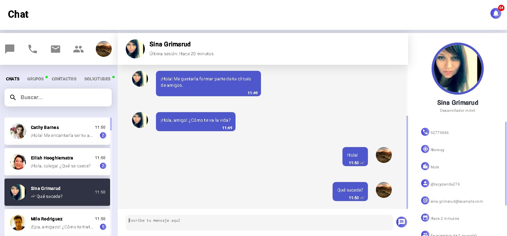
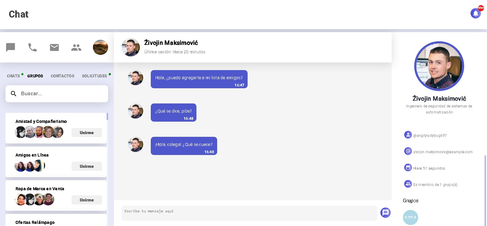
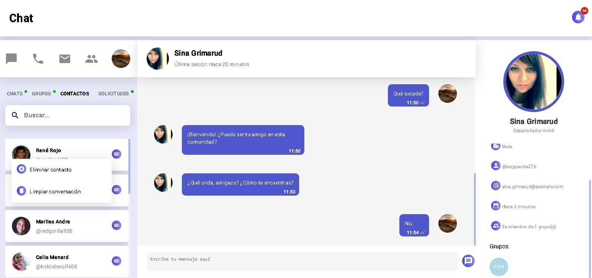
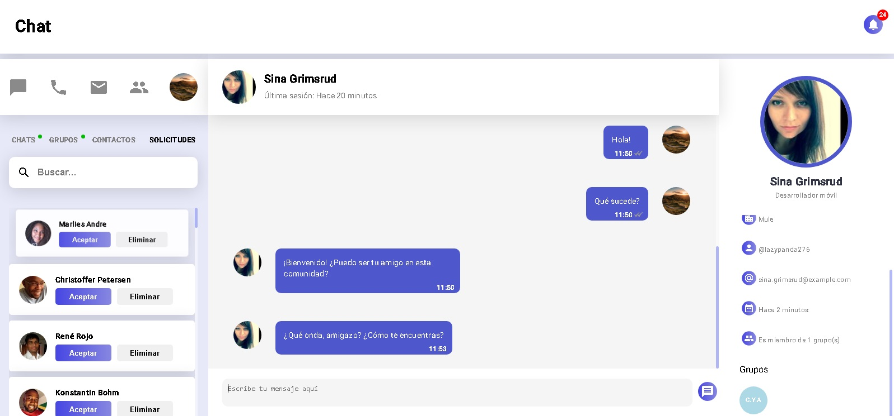

# Chat interactive

Un sistema de mensajería el cual simula interacciones a través de usuarios de prueba por medio de la API 
[**_randomuser.me_**](https://randomuser.me/)
 
Los usuarios de prueba, una vez que se registran, pueden realizar diferentes acciones

## Los usuarios de prueba pueden:

- Registrarse
- Enviar mensajes al usuario
- Crear grupos
- Unirse a grupos
- Enviar solicitudes de amistad al usuario

## Imágenes:

## Tecnologías utilizadas:

- HTML
- CSS
- TypeScript
- Angular